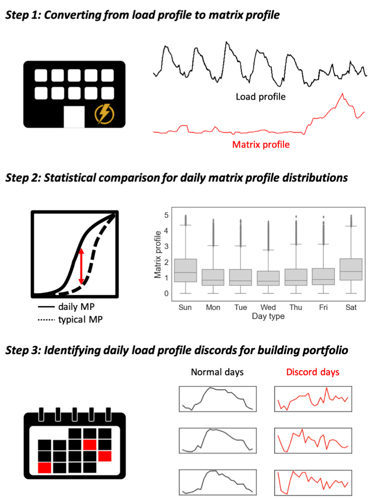

# The good, the bad, and the ugly: Data-driven load profile discord identification in a large building portfolio

## Project Description:

A project focused on developing a data-driven algorithm for automated load profile discord identification (ALDI) in a large portfolio of buildings.

## Project Collaborators:
- Intelligent Environments Laboratory, UT Austin, (http://nagy.caee.utexas.edu)
- Buildings and Thermal Sciences Center, NREL, (https://www.nrel.gov/buildings/index.html)

## Citation of the project:
Park, June Young, et al. "The good, the bad, and the ugly: Data-driven load profile discord identification in a large building portfolio." Energy and Buildings 215 (2020): 109892. (https://doi.org/10.1016/j.enbuild.2020.109892)
